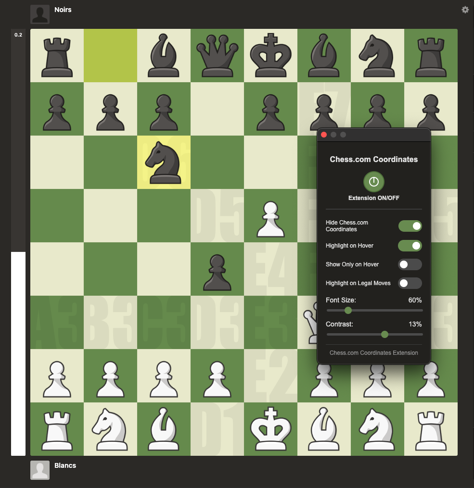
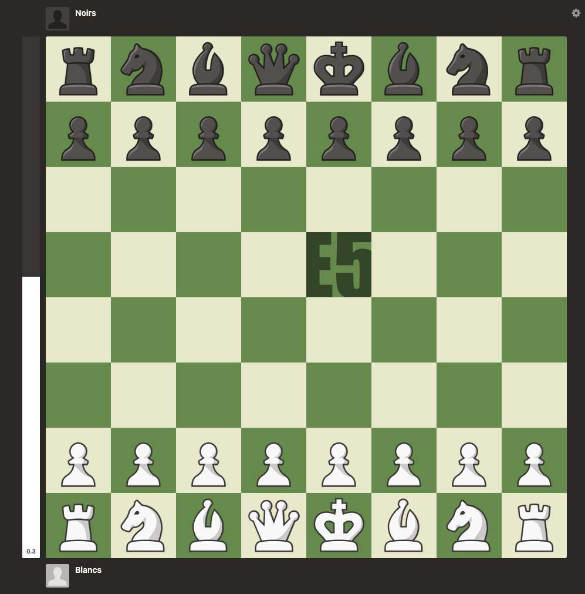
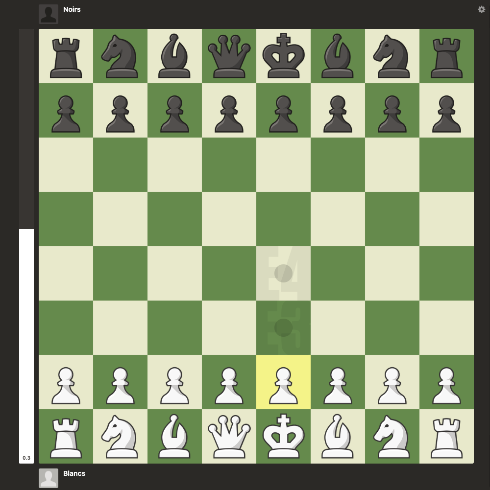
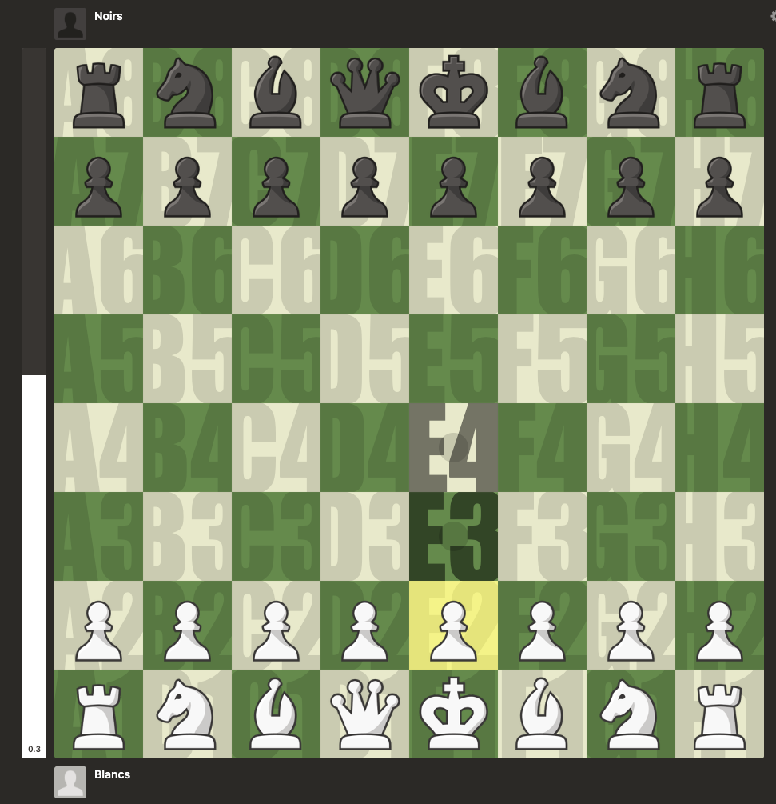
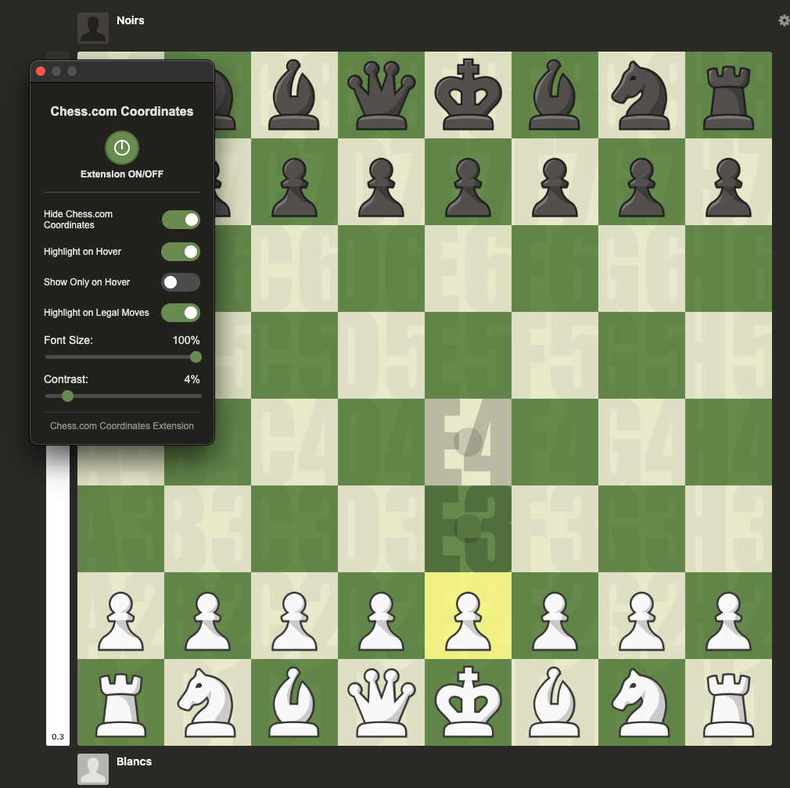

# Chess.com Coordinates Extension

Enhance chess coordinate learning on Chess.com by clearly displaying square names on the board, with customization options to accommodate all learning styles.

## Demo

### Video Demonstration

### Screenshots

  
  
  
  
  

## Features

- Displays coordinates on the chess.com board
- Hover effect that highlights the square being hovered over
- Works whether the board is flipped or not
- Toggle button to enable/disable coordinate display
- Hide/show Chess.com's original coordinates
- Enable/disable the hover highlight effect
- Show coordinates only on hover
- Highlight coordinates on legal moves for selected pieces
- Adjust the font size of coordinates (50-100%)
- Adjust the contrast/opacity of coordinates (2-20%)

## Prerequisites

For optimal display of coordinates, the **Impact** font should be installed on your system. If Impact is not available, the extension will fall back to Arial Black or sans-serif fonts, but the visual experience may be slightly different.

## Installation

### Development Mode Installation

1. Download or clone this repository to your computer
2. Open Chrome and go to `chrome://extensions/`
3. Enable "Developer mode" in the top right corner
4. Click "Load unpacked extension"
5. Select the `chess_coordinates_extension` folder

### Installation from Chrome Web Store (coming soon)

1. Go to the extension page on the Chrome Web Store
2. Click "Add to Chrome"
3. Confirm the installation

## Usage

1. Visit [chess.com](https://www.chess.com)
2. The extension will activate automatically when a chessboard is detected
3. Square coordinates will be displayed on the board
4. Hover over a square to highlight its coordinates
5. Click the extension icon to access the settings popup where you can:
   - Turn the extension ON/OFF with the power button at the top
   - Hide/show Chess.com's original coordinates
   - Enable/disable the hover highlight effect
   - Show coordinates only on hover
   - Highlight coordinates on legal moves for selected pieces
   - Adjust the font size of coordinates (50-100%)
   - Adjust the contrast/opacity of coordinates (2-20%)

## Troubleshooting

If coordinates are not displaying correctly:

1. Refresh the page
2. Open the browser console (F12) and check for error messages
3. Reset the extension by typing `window.reinitChessCoordinates()` in the console

## Roadmap

This roadmap outlines the features that have been implemented and potential future enhancements for the Chess.com Coordinates Extension.

### Completed Features

- ~~Display coordinates on the chess.com board~~
- ~~Hover effect that highlights the square being hovered over~~
- ~~Support for flipped board orientation~~
- ~~Toggle button to enable/disable coordinate display~~
- ~~Hide/show Chess.com's original coordinates~~
- ~~"Show Only on Hover" feature to reduce visual clutter~~
- ~~Highlight coordinates on legal moves for selected pieces~~
- ~~Font size adjustment (50-100%)~~
- ~~Opacity/contrast adjustment (2-20%)~~
- ~~Dark theme for the settings interface~~
- ~~Capture hint detection for legal moves~~

### Future Enhancements

- Todo items from github issues...

We welcome suggestions for new features! Please submit your ideas through the issue tracker.

## Contributing

Contributions are welcome! This project is open source and we encourage developers to help improve the Chess.com Coordinates Extension.

Please read [CONTRIBUTING.md](CONTRIBUTING.md) for detailed information on how to contribute to this project, including:

- Reporting bugs
- Suggesting enhancements
- Submitting pull requests
- Development setup
- Code style guidelines
- Feature ideas

We look forward to your contributions!

## License

This project is licensed under the MIT License.
